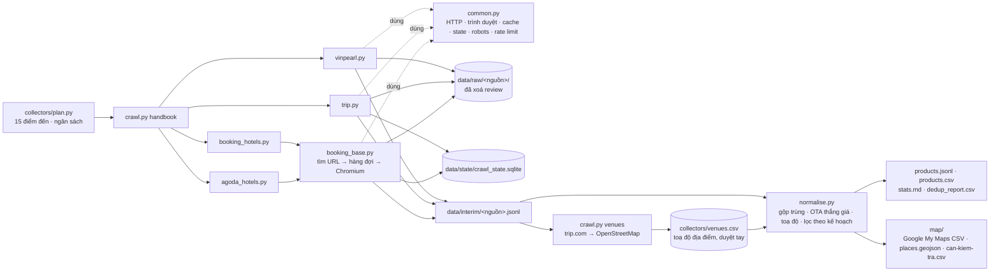

# data-collection — catalog du lịch cho V-OTA RecSys

Thu thập catalog theo đúng **handbook §3**: khoảng 2.000–5.000 sản phẩm thật (hotel, flight, attraction, combo, golf)
trên 15 điểm đến Việt Nam, mô tả tiếng Việt, xuất theo schema `Product` ở §6.

| Handbook yêu cầu | Làm ở đây |
|---|---|
| vinpearl.com trước: khách sạn, VinWonders, golf, combo | `crawl.py vinpearl`: API của booking.vinpearl.com (vinpearl.com có Cloudflare) |
| booking.com: độ phủ chỗ ở, thuộc tính có cấu trúc | `crawl.py booking-hotels`: N khách sạn phổ biến mỗi điểm đến + hạng phòng + giá |
| agoda.com: phủ tốt chỗ ở nội địa | `crawl.py agoda-hotels`: N khách sạn phổ biến mỗi điểm đến + giá |
| trip.com: vé máy bay, điểm tham quan (gợi ý chéo tuần 3) | `crawl.py trip-flights`, `crawl.py trip-attractions` |
| 2.000–5.000 sản phẩm, 10–15 điểm đến | `collectors/plan.py`: 15 điểm đến, ngân sách mỗi điểm đến |
| Gộp trùng: vinpearl.com thắng tên/mô tả, OTA thắng giá/tình trạng | `normalise.py` |
| Toạ độ nếu có | khách sạn và điểm tham quan theo nguồn, vé Vinpearl theo địa điểm dùng vé, vé máy bay theo sân bay; xuất cho Google My Maps + GeoJSON (xem [Vị trí và Google Maps](#vị-trí-toạ-độ-và-google-maps)) |
| Chỉ dữ liệu sản phẩm, không review / tên người | review bị xoá khỏi HTML/JSON **trước khi** ghi cache |
| Cache raw, rate limit, robots.txt, resume, README nguồn trường | có đủ, xem bên dưới |
| Fallback Amadeus Self-Service | **đã ngừng hoạt động từ 17/07/2026** (Amadeus chỉ còn gói Enterprise), nên không dùng |

## Cài đặt

Cần Python 3.10 trở lên (đã chạy thử trên 3.10 và 3.14).

```bash
cd data-collection
conda activate vsf                  # hoặc: python -m venv .venv && source .venv/bin/activate
pip install -r requirements.txt
playwright install chromium         # Linux thiếu thư viện hệ thống: playwright install --with-deps chromium
```

## Chạy

Chạy trọn kế hoạch (Vinpearl → trip.com → booking.com → agoda.com → normalise), ước tính 2–3 giờ:

```bash
python crawl.py handbook --fast
```

Chạy thử nhỏ trước (2 điểm đến, 3 sản phẩm mỗi loại, khoảng 15 phút):

```bash
python crawl.py handbook --destinations 'Nha Trang,Phú Quốc' --per-destination 3 --tour-limit 25 --fast
```

Hoặc chạy từng nguồn, theo thứ tự handbook:

```bash
python crawl.py vinpearl
python crawl.py trip-flights
python crawl.py trip-attractions
python crawl.py booking-hotels --fast --concurrency 2
python crawl.py agoda-hotels
python crawl.py venues              # toạ độ địa điểm vé Vinpearl (chỉ gọi mạng cho địa điểm chưa có toạ độ)
python normalise.py
```

Kết quả: `data/products.jsonl`, `data/products.csv`, `data/stats.md` (có bảng **đối chiếu mục tiêu handbook**),
`data/dedup_report.csv` và thư mục `data/map/` (bản đồ).

Ctrl+C lúc nào cũng được: chạy lại đúng lệnh cũ sẽ tiếp tục từ chỗ dừng. `python crawl.py status` xem tiến độ.

## Kế hoạch: 15 điểm đến

Chọn các điểm đến có Vinpearl trước, rồi thêm các điểm du lịch lớn. Slug/mã của từng nguồn đã được kiểm tra thủ công
và nằm trong [collectors/plan.py](collectors/plan.py).

| Điểm đến | Vinpearl | booking.com tìm | agoda city | trip.com city | Sân bay |
|---|---|---|---|---|---|
| Nha Trang | ✓ | Nha Trang | nha-trang-vn | nha-trang-670 | CXR |
| Phú Quốc | ✓ | Phu Quoc | phu-quoc-island-vn | phu-quoc-island-24779 | PQC |
| Hội An | ✓ | Hoi An | hoi-an-vn | hoi-an-668 | (qua DAD) |
| Đà Nẵng | | Da Nang | da-nang-vn | da-nang-669 | DAD |
| Hạ Long | ✓ | Ha Long | h-long-vn | ha-long-city-1524623 | VDO |
| Hà Nội | ✓ | Hanoi | hanoi-vn | hanoi-181 | HAN |
| TP. Hồ Chí Minh | | Ho Chi Minh City | ho-chi-minh-city-vn | ho-chi-minh-city-434 | SGN |
| Hải Phòng | ✓ | Hai Phong | haiphong-vn | haiphong-180 | HPH |
| Nghệ An | ✓ | Cua Lo | vinh-vn | vinh-city-24768 | VII |
| Hà Tĩnh | ✓ | Ha Tinh | ha-tinh-vn | – | (qua VII) |
| Đà Lạt | | Da Lat | dalat-vn | dalat-1393 | DLI |
| Huế | | Hue | hue-vn | hue-667 | HUI |
| Quy Nhơn | | Quy Nhon | quy-nhon-binh-dinh-vn | quy-nhon-24728 | UIH |
| Sa Pa | | Sa Pa | sapa-vn | sapa-24736 | – |
| Phan Thiết | | Mui Ne | phan-thiet-vn | phan-thiet-1218 | – |

Ngân sách mặc định **mỗi điểm đến**: 30 khách sạn booking.com, 20 khách sạn agoda.com (khách sạn trùng sẽ được gộp),
25 điểm tham quan trip.com, tối đa 3 hạng phòng OTA mỗi khách sạn, 5 chuyến bay cụ thể mỗi tuyến. Toàn bộ sản phẩm
Vinpearl luôn được lấy, cộng mọi khách sạn mang thương hiệu Vinpearl trên booking.com. Ước tính catalog cuối
khoảng **3.000–3.500 sản phẩm**.

- Đổi điểm đến: `--destinations 'Nha Trang,Đà Lạt'` (áp dụng cho cả `crawl.py` và `normalise.py`), hoặc sửa `plan.py`.
- Đổi quy mô: `--per-destination 40` (khách sạn booking và điểm tham quan = 40, agoda = 2/3 con số đó).
- Sau khi đổi kế hoạch, thêm `--rediscover` để tìm URL mới.

## Nguồn và cách lấy

| Nguồn | Cách lấy | Trình duyệt | Lấy được |
|---|---|---|---|
| **Vinpearl, khách sạn** | `booking-hotel-api.vinpearl.com` `/availability/rooms` cho nhiều ngày (`--price-dates`) | không | mô tả, địa chỉ, toạ độ, sao, điểm TripAdvisor, tiện nghi, ảnh; mỗi hạng phòng: mô tả, diện tích, giường, sức chứa, giá theo ngày |
| **Vinpearl, vé/tour/combo/golf** | `booking-tour-api.vinpearl.com`, gọi từ trong trang booking.vinpearl.com | có (Cloudflare) | tên, mô tả chi tiết, bao gồm, lịch trình, giá người lớn/trẻ em, thời gian bán, nhà cung cấp (= nơi dùng vé, để suy ra toạ độ). **API không có toạ độ** |
| **trip.com, vé máy bay** | trang sân bay `/flights/airport-<iata>/` → tuyến giữa các điểm đến → trang giá vé `/flights/<a>-to-<b>/airfares-…/` (JSON-LD) | không | giá theo tháng, khứ hồi, chuyến cụ thể (số hiệu, hãng, giờ, thời gian bay, giá) |
| **trip.com, điểm tham quan** | `/travel-guide/attraction/<city>/tourist-attractions/` → trang điểm (`__NEXT_DATA__`) | không | giới thiệu, địa chỉ, toạ độ, **giờ mở cửa**, **thời lượng đề xuất**, giá vé, điểm, loại hình |
| **booking.com, khách sạn** | trang tìm kiếm theo điểm đến (`order=popularity`) + sitemap lọc thương hiệu Vinpearl → trang khách sạn kèm ngày | có | mô tả tiếng Việt, toạ độ, sao, điểm, tiện nghi, hạng phòng + giá + điều kiện |
| **agoda.com, khách sạn** | trang thành phố → trang khách sạn kèm ngày | có | mô tả tiếng Việt, toạ độ, sao, điểm, tiện nghi, giá rẻ nhất |
| booking.com, attraction *(nguồn phụ, ngoài kế hoạch)* | sitemap → trang attraction | có | mô tả (đa phần tiếng Anh), thời lượng, bao gồm, điểm khởi hành, giá |

Robots.txt được tôn trọng. Riêng trip.com cấm các trang tìm chuyến bay (`showfarefirst`, `/*-to-*/tickets-*`,
`graphql`), nên script chỉ dùng trang giá vé theo tuyến, loại trang được phép.

### Vì sao cần trình duyệt, và `--headless`

Script dùng Chromium thật qua Playwright, **không** dùng stealth plugin, giả fingerprint, proxy hay giải CAPTCHA.
Kết quả chạy thử (15/09/2026):

| | Có cửa sổ (mặc định) | `--headless` |
|---|---|---|
| Vinpearl khách sạn, trip.com (HTTP) | chạy | chạy |
| Vinpearl vé/tour | chạy | **bị Cloudflare chặn** |
| booking.com: dữ liệu khách sạn | chạy | chạy |
| booking.com: **giá** | chạy | **không có giá** |
| agoda.com | chạy | chưa thử |

Nếu cửa sổ hiện ô "Xác minh bạn là con người", **bạn tự bấm** trong cửa sổ đó; script chờ tối đa `--manual-wait` giây.
Server không có màn hình: `xvfb-run -a python crawl.py handbook`.

`--fast` (không chờ trang tải xong, chặn CSS/tracker) nhanh gấp đôi với booking.com; agoda.com tự tắt chế độ này
vì trang không render khi thiếu CSS.

## Luồng xử lý



## Dữ liệu nằm ở đâu

Mặc định trong `data-collection/data/` (đổi bằng `--data-dir` hoặc `VOTA_DATA_DIR`):

| Đường dẫn | Chứa gì |
|---|---|
| `raw/vinpearl/json/` | JSON gốc API Vinpearl: `api-rooms-<hotelId>-<ngày>-2a`, `api-tour-list-*`, `api-tour-detail-<slug>` |
| `raw/trip_flights/json/`, `raw/trip_attractions/json/` | JSON-LD + dữ liệu sản phẩm của trang (review đã bỏ), kèm URL; `html/` là trang danh sách |
| `raw/booking_hotels/html/` | trang khách sạn và trang tìm kiếm, bản gọn (~45 KB/trang, đã bỏ review); `xmlgz/` là sitemap |
| `raw/agoda_hotels/html/` | trang khách sạn và trang thành phố (đã bỏ review) |
| `interim/<nguồn>.jsonl` | bản ghi đã parse, mỗi nguồn một file |
| `raw/geocode/` | kết quả tìm địa điểm trên OpenStreetMap (Photon), mỗi truy vấn chỉ gửi một lần |
| `map/` | vị trí cho bản đồ: `mymaps-*.csv`, `places.geojson`, `can-kiem-tra.csv` |
| `state/crawl_state.sqlite` | hàng đợi URL (`items`: trạng thái, số lần thử, điểm đến + thứ hạng trong kế hoạch) và tiến độ tìm URL (`discovery`) |
| `browser-profile/<nguồn>/` | cookie trình duyệt |
| `logs/crawl-YYYYMMDD.log` | log |

Parser sai thì sửa code rồi chạy `python crawl.py reparse <nguồn>`: parse lại từ cache, không tải lại.

## Schema đầu ra

Mỗi dòng `products.jsonl` có đúng 13 trường của §6. Mọi trường khác nằm trong `attributes`, để không tự thêm
field mà CDP thật không có.

```json
{
  "productId": "9d5cd325-a23d-5907-90aa-7286e06d6654",
  "name": "Vinpearl Resort Nha Trang - Deluxe Giường Đôi",
  "taxonomy": "hotel",
  "destination": "Nha Trang",
  "description": "Với diện tích 32 m², Deluxe Giường Đôi là phòng khách sạn thiết kế hiện đại…",
  "attributes": { "level": "room", "starRating": 5, "oceanView": null, "familyFriendly": true, "maxOccupancy": 4,
                  "roomSizeM2": 32, "vinpearlPrice": 3040000, "otaRoomName": "…", "parentProductId": "…" },
  "unitPrice": 2788898,
  "currency": "VND",
  "available": true,
  "availableFrom": null,
  "availableTo": null,
  "imageUrl": "https://booking-static.vinpearl.com/room_types/…jpg",
  "sourceRef": "vinpearl:hotel:1dc9c659-…:room:26863e0c-…"
}
```

- `productId` = UUIDv5 của `sourceRef`, **ổn định giữa các lần chạy**.
- `taxonomy`: `hotel` (`attributes.level` = `property` / `room`), `flight` (`route` / `flight`), `attraction`, `combo`, `golf`.
- Tên theo mẫu handbook: `"<Khách sạn> - <Hạng phòng>"`, `"Vé máy bay Hà Nội - Nha Trang"`.
- Mô tả tự sinh (vé máy bay, phòng OTA, điểm tham quan thiếu giới thiệu) được đánh dấu bằng `attributes.descriptionSource`.

### Nguồn của từng trường

| Trường | Khách sạn / phòng | Vé máy bay | Điểm tham quan / vé |
|---|---|---|---|
| `name` | Vinpearl → booking → agoda | ghép từ tên thành phố | Vinpearl → trip.com |
| `description` | Vinpearl → booking (nếu tiếng Việt) → agoda | tự sinh từ dữ liệu chuyến bay | Vinpearl → trip.com (giới thiệu) |
| `destination` | `geo.py`: tên Vinpearl / thành phố / địa chỉ, tên cụ thể thắng tên tỉnh | thành phố đến | quận/huyện → địa chỉ → tỉnh |
| `unitPrice` | **booking.com → agoda.com → Vinpearl**; phòng Vinpearl khớp tên với phòng booking.com thì lấy giá booking | giá một chiều rẻ nhất | **trip.com → Vinpearl** |
| `available` | có giá cho ngày đã hỏi | có chuyến có giá | có giá vé (điểm công cộng không bán vé → `false`, `attributes.ticketed=false`) |
| `availableFrom/To` | – | ngày bay sớm nhất / muộn nhất thấy được | thời gian bán của vé Vinpearl |
| toạ độ (`latitude`, `longitude`) | nguồn chính; nghi sai hoặc thiếu thì nguồn khác | sân bay đến | vé Vinpearl: địa điểm dùng vé (`venues.csv`), rồi trip.com; điểm tham quan: trip.com |
| sao | nguồn chính, thiếu thì nguồn khác | – | – |
| giờ mở cửa, thời lượng | – | thời gian bay | trip.com (`openingHours`, `suggestedDuration`, `durationMinutes`) |
| giá khác | `vinpearlPrice`, `otaPrices`, `bookingReviewScore`, `agodaReviewScore` | `monthlyPrices`, `roundTripFrom` | `vinpearlPrice`, `otaPrices` |

### Gộp trùng

- **Khách sạn**: so khớp tên (bỏ dấu, bỏ "khách sạn/khu nghỉ dưỡng/hotel", thử cả tên tiếng Anh trong ngoặc của agoda)
  kết hợp khoảng cách toạ độ, trong cùng điểm đến. Mỗi cụm có tối đa một bản của mỗi nguồn. Ví dụ chạy thử:
  "Vinpearl Resort Nha Trang" (Vinpearl) ↔ booking.com cách 523 m; "Hòn Tằm Resort" ↔ agoda "Khu nghỉ dưỡng Hòn Tằm (…)" cách 670 m.
- **Điểm tham quan**: điểm trip.com trùng tên vé Vinpearl thì gộp vào vé. Các vé Vinpearl khác có chứa tên điểm đó được
  bổ sung giờ mở cửa, thời lượng, toạ độ.
- Mọi cặp đã gộp nằm trong `dedup_report.csv`; kiểm tra tay trước khi dùng.

## Vị trí (toạ độ) và Google Maps

Toạ độ nằm trong `attributes.latitude` / `attributes.longitude` (độ thập phân, cùng hệ với Google Maps), kèm:

- `locationSource`: `vinpearl`, `booking.com`, `agoda.com`, `trip.com`, `osm`, `manual`, `ourairports`
- `locationPrecision`: `exact` (vị trí riêng của khách sạn / điểm tham quan), `venue` (khu vui chơi, sân golf nơi dùng vé),
  `poi` (điểm tham quan trip.com trùng tên vé), `airport` (sân bay đến; `originLatitude/originLongitude` là sân bay đi)
- `locationWarning` (toạ độ đáng ngờ), `locationNote` (đã thay toạ độ nguồn chính), `venue` (tên địa điểm dùng vé)

| Loại | Toạ độ lấy từ |
|---|---|
| Khách sạn | API Vinpearl, booking.com, agoda.com. Hạng phòng dùng toạ độ khách sạn |
| Vé, combo, golf Vinpearl | API không có toạ độ. Nhà cung cấp của vé chính là nơi dùng vé (VinWonders Nha Trang…) → `collectors/venues.csv` |
| Điểm tham quan | trip.com |
| Vé máy bay | sân bay đến, dữ liệu OurAirports trong `collectors/geo.py` |

### Toạ độ nghi sai

API Vinpearl có toạ độ sai. `normalise.py` đánh dấu những toạ độ này và không dùng chúng khi ghép trùng. Nếu khách sạn có
bản booking.com/agoda thì lấy toạ độ bên đó (ghi lý do vào `locationNote`); nếu không thì giữ và ghi `locationWarning`.

- **Trùng toạ độ (≤ 30 m) với khách sạn Vinpearl khác địa chỉ.** Vinpearl Empire Nha Trang (Lê Thánh Tôn, trong thành
  phố) trùng khít Vinpearl Luxury Nha Trang trên đảo Hòn Tre. Vinpearl Resort Nha Trang trùng Vinpearl Resort & Spa
  Nha Trang Bay, và trùng luôn điểm "Hòn Tre" trên trip.com, tức chỉ là toạ độ chung của cả đảo.
- **Cách tâm điểm đến xa hơn bán kính trong `geo.py`** (mặc định 40 km). Vinpearl Hà Tĩnh cách thành phố Hà Tĩnh 34 km
  (bán kính Hà Tĩnh là 30 km).

Muốn sửa tay toạ độ của bất kỳ sản phẩm nào: thêm dòng `sourceRef,latitude,longitude,note` vào
`collectors/location_overrides.csv`, rồi chạy lại `normalise.py`. Toạ độ sửa tay thắng mọi nguồn.

### Địa điểm dùng vé Vinpearl: `collectors/venues.csv`

Bảng này có 23 địa điểm (VinWonders, Safari, Grand World, Aquafield, các sân golf…). Vé được khớp địa điểm theo mã nhà
cung cấp; không có mã thì theo alias trong tên vé, ví dụ `[Vinpearl Golf Nha Trang] …`. Nếu vé khớp qua nhà cung cấp mà
điểm đến lệch với điểm đến của địa điểm, vé nhận điểm đến của địa điểm (giá trị cũ giữ ở `attributes.originalDestination`).
Lý do là tỉnh trong API hay sai: Vinpearl Golf Léman ở Củ Chi (TP.HCM) bị ghi Hải Phòng, vé Grand World Hà Nội bị tính
thành Phú Quốc.

`python crawl.py venues` điền toạ độ cho các dòng chưa có. Thứ tự tìm: điểm tham quan trip.com đã crawl, rồi
OpenStreetMap (qua Photon). Kết quả chỉ được nhận khi chứa đủ mọi từ của tên cần tìm và nằm trong bán kính điểm đến; kết
quả là trạm xe buýt hay con đường mang tên địa điểm thì bị loại. Chạy ngày 15/09/2026, 17/23 địa điểm tự tìm được toạ độ,
6 địa điểm cần duyệt tay.

| status | Nghĩa | normalise dùng? |
|---|---|---|
| `ok` | đã kiểm tra bằng mắt; script không bao giờ ghi đè | có |
| `auto` | tự tìm được, qua kiểm tra | có |
| `review` | không tìm thấy hoặc không qua kiểm tra; `note` ghi lý do, toạ độ là kết quả đã bị loại | không |

Cách duyệt:

1. Mở `data/map/can-kiem-tra.csv` (hoặc thẳng `collectors/venues.csv`), bấm link ở cột `googleMapsUrl` / `mapUrl` để xem ghim.
2. Ghim sai hoặc chưa có: tìm đúng vị trí trên bản đồ, điền `latitude`, `longitude` (độ thập phân), đặt `source=manual`,
   `status=ok`. Ghim đúng: chỉ cần đổi `status=ok`.
3. Chạy lại `python normalise.py`.

Nên sửa CSV bằng VS Code, LibreOffice hoặc Google Sheets (lưu UTF-8); Excel có thể làm hỏng dấu tiếng Việt. Muốn thêm
địa điểm thì thêm dòng có `key, name, destination`, `suppliers` hoặc `aliases`, `queries`. Nhà cung cấp mới xuất hiện
trong dữ liệu Vinpearl sẽ được `crawl.py venues` tự thêm dòng.

### Đưa lên Google Maps: `data/map/`

Mỗi địa điểm là một ghim: hạng phòng gộp vào ghim khách sạn, vé/combo gộp vào ghim địa điểm, vé máy bay gộp vào ghim
sân bay đến.

| File | Dùng cho |
|---|---|
| `mymaps-khach-san.csv`, `mymaps-vui-choi.csv`, `mymaps-san-bay.csv` | Google My Maps, mỗi file là một lớp. My Maps không nhận file quá 2.000 dòng, nên lớp lớn được tách thành `-2`, `-3`… |
| `places.geojson` | web app (Maps JavaScript API); mỗi ghim có danh sách `items` gồm productId, tên, giá |
| `can-kiem-tra.csv` | các vị trí cần xem bằng mắt |

Các cột CSV: `name`, `latitude`, `longitude`, `category`, `destination`, `description` (tóm tắt số phòng/vé, giá từ),
`products`, `priceFromVnd`, `available`, `starRating`, `url`, `imageUrl`, `locationSource`, `locationPrecision`,
`warning`, `googleMapsUrl`, `placeKey`.

Import vào Google My Maps:

1. Vào [mymaps.google.com](https://mymaps.google.com), tạo bản đồ mới.
2. Dưới lớp đầu tiên, bấm **Import** (Nhập) và chọn `mymaps-khach-san.csv`.
3. Cột vị trí chọn `latitude` và `longitude`; cột tiêu đề chọn `name`.
4. Thêm lớp mới, lặp lại với `mymaps-vui-choi.csv` và `mymaps-san-bay.csv`. Có thể tô màu ghim theo cột `category`
   hoặc `warning` để thấy ngay ghim đáng ngờ.

Web app:

```js
map.data.loadGeoJson("places.geojson");   // GeoJSON ghi [kinh độ, vĩ độ]
map.data.addListener("click", (e) => console.log(e.feature.getProperty("name"), e.feature.getProperty("items")));
```

## Kiểm tra trước khi coi là xong tuần 1

1. Mở `data/stats.md`, xem bảng **Đối chiếu handbook §3** (số sản phẩm, số điểm đến, đủ loại, tỷ lệ tiếng Việt, có giá)
   và bảng điểm đến × loại sản phẩm.
2. Đọc tay 15 mẫu cuối `stats.md`.
3. Xem `dedup_report.csv`.
4. Sản phẩm Vinpearl ngoài 15 điểm đến (Bắc Ninh, Tây Ninh…) vẫn được giữ và đánh dấu *(ngoài kế hoạch)* trong bảng.
5. Xem mục **Vị trí (toạ độ)** trong `stats.md` và duyệt `data/map/can-kiem-tra.csv`.

## Tuỳ chọn hay dùng

| Lệnh | Tuỳ chọn | Ý nghĩa |
|---|---|---|
| mọi lệnh crawl | `--destinations`, `--per-destination` | đổi kế hoạch |
| | `--fast` | nhanh hơn (booking.com); agoda tự bỏ qua |
| | `--headless` | không mở cửa sổ (mất giá booking.com và vé Vinpearl) |
| | `--delay 5`, `--concurrency 2` | tốc độ |
| | `--rediscover` | tìm URL lại sau khi đổi kế hoạch |
| | `--limit N`, `--discover-only` | chạy thử |
| `vinpearl` / `handbook` | `--price-dates 30,14,60` | các ngày hỏi giá phòng Vinpearl (số ngày từ hôm nay hoặc `YYYY-MM-DD`) |
| | `--tour-limit N` | chỉ lấy chi tiết N vé/tour (chạy thử) |
| `booking-hotels`, `agoda-hotels` | `--checkin 2026-10-15 --nights 1 --adults 2` | ngày lấy giá (mặc định hôm nay + 30) |
| `booking-hotels` | `--all-vietnam` | thêm toàn bộ ~34.000 chỗ ở VN (ngoài handbook, vài ngày) |
| `venues` | `--refresh` | tìm lại cả dòng `auto`/`review` (dòng `ok` luôn giữ nguyên) |
| | `--only vinwonders-cua-hoi,hon-tam` | chỉ các địa điểm này |
| | `--offline` | không gọi mạng: chỉ dùng trip.com đã crawl và cache |
| `normalise.py` | `--no-plan` | giữ mọi thứ đã crawl, không lọc theo kế hoạch |
| | `--rooms-per-hotel 3`, `--flights-per-route 5` | số phòng OTA / chuyến bay cụ thể giữ lại |
| | `--vietnamese-only`, `--min-description 80` | lọc chất lượng mô tả |
| | `--drop-member-variants` | bỏ bản sao giá thành viên của vé Vinpearl (`[VIN33 - Gold]`…) |
| | `--usd-vnd 26300` | tỷ giá khi nguồn không trả VND |

Chạy nhiều ngày (khi dùng `--all-vietnam`): `./run_forever.sh booking-hotels --fast --concurrency 3`. Script tự
nghỉ và chạy tiếp khi bị chặn (mã thoát 75).

## Khi có sự cố

| Hiện tượng | Cách xử lý |
|---|---|
| `Chưa cài trình duyệt cho Playwright` | `playwright install chromium` |
| Log báo "Bị chặn … dừng" | nghỉ vài giờ, chạy lại cùng lệnh; cân nhắc `--delay 6` |
| Cửa sổ đứng ở "Chờ một chút…" | bấm xác minh trong cửa sổ đó |
| booking.com không có giá | đang `--headless`, hoặc hết phòng ngày đó → `--checkin` khác rồi `retry-failed` |
| `Nguồn … đang được một tiến trình khác chạy` | mỗi nguồn chỉ một tiến trình; đợi tiến trình kia xong |
| Sửa parser xong | `python crawl.py reparse <nguồn>` rồi `python normalise.py` |
| Vé Vinpearl không có toạ độ | xem `data/map/can-kiem-tra.csv`: địa điểm đang `review`, hoặc vé chưa khớp địa điểm nào |
| Ghim khách sạn sai chỗ | thêm dòng vào `collectors/location_overrides.csv` |
| Log báo bản ghi Vinpearl chưa có `supplierCode` | dữ liệu crawl trước khi có trường này: `python crawl.py reparse vinpearl` (đọc cache, không tải lại; chạy ngày khác ngày crawl vẫn dùng đúng các ngày giá đã cache) |
| `crawl.py venues` lỗi mạng / Photon trả 429 | chạy lại sau; truy vấn đã có kết quả được lưu trong `raw/geocode/` |
| Catalog lệch khỏi 2.000–5.000 | chỉnh `--per-destination` hoặc `--destinations` rồi `--rediscover` |

## Dữ liệu cá nhân và pháp lý

- Theo handbook: chỉ lấy dữ liệu sản phẩm. Review, tên và ảnh đại diện người đánh giá, trích dẫn review
  ("điểm nổi bật" của agoda) bị xoá khỏi HTML/JSON **trước khi ghi đĩa**. Chỉ giữ điểm trung bình và số lượt đánh giá.
- Vinpearl là dữ liệu của chính công ty; nếu dùng lâu dài nên xin đội kỹ thuật Vinpearl quyền truy cập API.
- Điều khoản của booking.com và agoda.com không cho phép thu thập tự động. Dữ liệu chỉ dùng nội bộ cho demo thực tập,
  không phân phối lại.
- Không ghi gì vào CDP hay Insider production.
- Toạ độ từ OpenStreetMap theo giấy phép ODbL: khi hiển thị hay chia sẻ bản đồ, ghi "© OpenStreetMap contributors".
  Trang Photon cho phép dùng API cho dự án nếu dùng vừa phải; script lưu cache mỗi truy vấn và gửi cách nhau ≥ 1 giây.
  robots.txt của photon.komoot.io chặn crawler trang web, còn đây là gọi API nên không kiểm tra robots.
- Toạ độ sân bay từ OurAirports (public domain).
- Không lấy toạ độ từ Google Geocoding/Places API để lưu vào catalog: điều khoản Google Maps Platform chỉ cho lưu tạm
  lat/lng tối đa 30 ngày. Link Google Maps trong các file CSV chỉ để mở xem.
