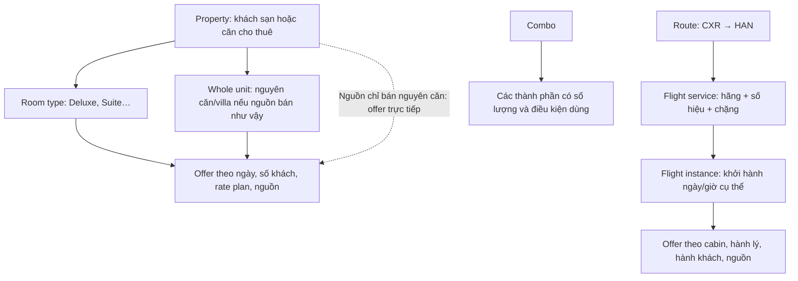
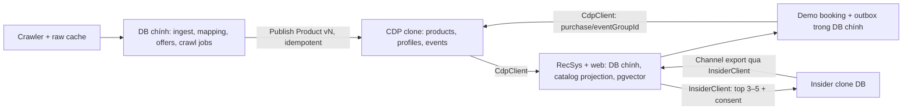

# Thiết kế dữ liệu V-OTA cho demo RecSys

Ngày thiết kế: 18/09/2026. Trạng thái: **đề xuất để triển khai**, chưa migrate DB hoặc thay catalog hiện có.

## 1. Quyết định đã chốt với người dùng

- Vinpearl: nền nội dung khách sạn, resort, phòng, villa và golf; VinWonders: vé và combo chính thức.
- Booking: chỗ ở và **nguồn chính cho giá/chuyến bay**. Agoda bổ sung chỗ ở. Trip.com bổ sung chuyến bay, điểm tham quan và dữ liệu khác có thể xác minh.
- Chỉ dữ liệu sản phẩm thật. **Không sinh giá, lịch bay hoặc ngày available random.** Ngày chưa kiểm tra là `unknown`.
- Giá là giá quan sát tại thời điểm cào cho một ngày sử dụng và cấu hình khách cụ thể.
- Thiết kế trước cho 15 điểm đến trong `collectors/plan.py`; mặc định chỗ ở 1 đêm, 1 đơn vị, 2 người lớn, không trẻ em; bay một chiều, 1 người lớn, economy. Đây là cấu hình thu thập ban đầu, không phải khả năng phục vụ mọi cấu hình khách.
- Có 3 DB: chính, CDP clone, Insider clone. Chưa có schema CDP production; schema dưới đây bám hợp đồng minh hoạ handbook, **không tuyên bố khớp production**.
- Ưu tiên vòng lặp RecSys chạy được. Theo handbook §3: 2.000–5.000 sản phẩm thật, 10–15 điểm đến. Mở rộng số ngày tạo thêm báo giá, không cần nhân số bản ghi embedding theo ngày.

## 2. Kết luận kiểm tra template và catalog

Template 13 trường là hợp đồng trao đổi hợp lý; **chưa đủ làm toàn bộ mô hình quan hệ**. Cần tách nội dung sản phẩm, phân cấp, định danh nguồn và báo giá/lịch theo ngữ cảnh.

Audit được chạy đọc-only trên `data/products.jsonl` và file người dùng cung cấp; xem `audit-current.json`, `audit-user-template.json`. Kết quả tại lúc kiểm tra:

| Hạng mục | Kết quả | Ý nghĩa |
|---|---:|---|
| Tổng sản phẩm | 2.216 | 1.466 hotel, 244 flight, 407 attraction, 93 combo, 6 golf |
| Hotel | 559 property + 907 room | Cần phân biệt parent và đơn vị thực sự bán được |
| Flight | 60 route + 184 flight | Chưa phải 184 chuyến khởi hành ở những ngày cụ thể |
| Thiếu `unitPrice` | 140 | Không đáp ứng export yêu cầu giá bắt buộc; giữ staging/discovery, không bịa giá |
| Thiếu `imageUrl` | 244 | Có thể null; UI dùng placeholder, không ghi placeholder là ảnh nguồn |
| Giá chọn lớn hơn `vinpearlPrice` đang lưu | 19 | Tín hiệu cần review, **không khẳng định so sánh được** vì ngày và điều kiện có thể khác |
| Product có giá nhưng thiếu `priceObservedAt`/`observedAt` trong attributes | 1.832 | Có thể phục hồi thời gian từ raw/interim; không gán thời gian reparse thành thời gian lấy giá |
| Flight thiếu `departureAt` có ngày | 184 | Chỉ có giờ và danh sách ngày; chưa đủ khoá một lần khởi hành |
| Combo thiếu `components` có cấu trúc | 93 | Chưa dùng được để tránh gợi ý lại thành phần đã mua trong combo |
| Parent bị mất trong catalog đầy đủ | 0 | Quan hệ hiện tại trong catalog đầy đủ không bị orphan |

Riêng mẫu 6 sản phẩm bạn gửi: phòng Junior Suite thiếu `parentProductId`; flight 9G2953 trỏ tới một route không có trong **file mẫu**, không có nghĩa route bị mất trong catalog đầy đủ. Tên khách sạn không thay thế được khoá ngoại.

Các điểm xác nhận trực tiếp từ code:

| Vị trí | Hành vi hiện tại | Cần thay |
|---|---|---|
| `normalise.py:996` | Chọn OTA đầu tiên, thường Booking | Chọn giá thấp nhất trong nhóm offer thực sự so sánh được |
| `normalise.py:1080–1110` | Khớp phòng bằng tên rồi đè giá Booking | Kiểm tra unit, sức chứa, ngày, bữa ăn, huỷ, thuế, điều kiện ưu đãi; cập nhật URL cùng offer |
| `normalise.py:858,912` | Min/max ngày thấy được thành availableFrom/To | Không coi khoảng này là lịch có vé liên tục |
| `normalise.py:902` | `datesSeen` bị giới hạn 14 ngày | Lưu toàn bộ observation trong bảng riêng |
| `collectors/common.py:255` | Queue khoá theo `(source,url)` | Job phải có ngày, khách, thời lượng và phiên thu thập |
| `collectors/booking_base.py:342` | Cache theo URL gốc, không theo ngữ cảnh giá | Cache riêng từng request và thời điểm quan sát |
| `normalise.py:98` | Giữ bản mới nhất theo key nguồn | Không dùng cách này để làm mất lịch sử báo giá các ngày |
| `collectors/vinpearl.py:427–443` | Gộp rate plan thành giá nhỏ nhất mỗi ngày | Giữ rate plan và điều kiện riêng trước khi chọn giá |

Repo chưa có collector Booking Flights hay collector riêng VinWonders. Vé/combo hiện tại đi qua API tour Vinpearl. Chỉ đổi nhãn nguồn thành Booking/VinWonders sẽ không biến chúng thành dữ liệu của nguồn đó.

## 3. Phân cấp: một sản phẩm không đồng nghĩa một thứ có thể đặt



### Chỗ ở

Giữ `taxonomy=hotel` cho cả hotel, apartment, villa, homestay để tương thích handbook. Trong `attributes`:

- `level`: `property`, `room`, hoặc `unit`.
- `propertyType`: hotel/resort/villa/apartment/homestay/unknown theo nguồn.
- `rentalMode`: room/entire_place/bed/unknown.
- `bookable`: bản ghi này có đại diện một đơn vị bán được hay chỉ gom nhóm.
- `parentProductId`: FK logic tới property nếu là phòng hoặc unit con.

Hotel bình thường: property chỉ gom nhóm (`bookable=false`), các hạng phòng là con. Property có giá “từ” chỉ dùng hiển thị, không đem giá đó gán cho phòng bất kỳ.

Nguồn bán một villa nguyên căn: có thể để chính property `rentalMode=entire_place`, `bookable=true`, offer trỏ trực tiếp vào property, không bắt buộc phải có room con. Nếu một khu có nhiều loại villa, mỗi loại là `unit` con, `rentalMode=entire_place`. Số phòng ngủ là đặc tính, không phải số đơn vị khách được mua.

Property không có room con nhưng nguồn cũng không nói thuê nguyên căn: `rentalMode=unknown`; không suy ra nguyên căn chỉ vì parser không lấy được phòng.

Đây là lời giải cho conflict bạn mô tả: **parent không bắt buộc luôn có child; room cũng không phải hình thức bán duy nhất của hotel.**

### Chuyến bay

- Route là cặp sân bay có hướng; CXR→HAN khác HAN→CXR. Thành phố có nhiều sân bay dùng bảng ánh xạ, không đồng nhất mã thành phố với IATA sân bay.
- Flight service: hãng khai thác + số hiệu + sân bay đi/đến; dùng làm sản phẩm nội dung để embedding, `parentProductId` trỏ route.
- Flight instance: service + thời điểm khởi hành theo nguồn; lưu đầy đủ `departureAt`, `arrivalAt` kèm offset, timezone IANA tại hai đầu. Không suy ngày đến chỉ từ HH:mm.
- Nếu có mã chuyến nguồn ổn định, dùng mã đó để cập nhật đổi giờ. Nếu chỉ có khoá suy từ lịch bay, lần đổi giờ phải đối chiếu trước khi tạo instance mới.
- Offer: instance/itinerary, số khách, cabin, fare class nếu có, hành lý, thuế/phí, hoàn/đổi, giá và URL.
- Chuyến nối chuyến có itinerary gồm nhiều segment theo thứ tự, giá cho **toàn hành trình**. Không chia giá hành trình thành giá từng chặng nếu nguồn không có. Có thể ưu tiên bay thẳng ở bản demo đầu, ghi rõ giới hạn.
- Codeshare không tự gộp chỉ vì cùng giờ; lưu marketing/operating carrier và bằng chứng cùng chuyến.

Không dùng giá thấp nhất của route hoặc giá trung bình tháng làm giá mua của một instance. Route/flight service có thể hiển thị giá “từ”; thao tác đặt demo phải chọn một offer cụ thể.

### Vé, combo và golf

- Tách venue/POI khỏi loại vé. VinWonders Nha Trang là địa điểm; vé người lớn cả ngày và vé sau 16h là các đơn vị bán khác nhau.
- `combo_components(combo_product_id, component_product_id, quantity, usage_rules)` biểu diễn quan hệ nhiều–nhiều. Thành phần chưa xác định được lưu raw/pending, không đoán ID chỉ từ từ khoá.
- Combo một ngày và hai ngày, cư dân địa phương và khách thường, vé trẻ em theo chiều cao, có/không buffet là điều kiện khác nhau.
- Golf có số hố, số người, tee time, gồm/không gồm buggy/caddie. Giá chưa biết tee time chỉ là reference.
- Ngày bán, ngày có thể sử dụng, ngày diễn ra sự kiện, ngày blackout là các khái niệm riêng.

## 4. Null và hợp đồng Product 13 trường

**Bắt buộc có key khác với bắt buộc có giá trị.** Giữ tất cả 13 key trong export; không dùng chuỗi `"null"`, `"N/A"` hoặc số 0 làm giá trị thay thế cho unknown.

| Trường | Có thể null trong export giá đã biết? | Quy tắc |
|---|---|---|
| productId | Không | UUID canonical ổn định |
| name | Không | Tên thật, không rỗng |
| taxonomy | Không | Một trong 5 taxonomy đã chốt |
| destination | Không | Nhãn chuẩn; staging chưa biết thì chờ mapping |
| description | Không | Văn bản nguồn hoặc dựng từ thuộc tính có chứng cứ, ghi `descriptionSource` |
| attributes | Không | Object; không bắt mọi taxonomy có cùng bộ key |
| unitPrice | Không | Giá đã biết; 0 chỉ khi nguồn xác nhận miễn phí |
| currency | Không | Mã ISO 4217; phải có đồng tiền từ nguồn hoặc phép chuyển đổi truy vết được |
| available | Không | Boolean phục vụ bộ lọc; unknown/stale ánh xạ false, kèm trạng thái chi tiết |
| sourceRef | Không | Tham chiếu nguồn gốc được chọn ổn định, không thay khi nguồn giá thay |
| imageUrl | Có | URL ảnh nguồn; UI tự chọn placeholder |
| availableFrom | Có | Mốc dùng sản phẩm được nguồn xác nhận; không tự điền bằng hôm nay |
| availableTo | Có | Có thể chỉ biết một đầu khoảng; không đặt mốc giả |

`product-ready.schema.json` là JSON Schema **đề xuất** cho export có giá. Các record không giá vẫn có giá trị cho tìm kiếm/POI: giữ staging hoặc discovery view riêng, không xoá nguồn. Nếu sau này muốn CDP chứa cả discovery và item có giá, cần chốt `unitPrice nullable` như một quyết định contract; không lặng lẽ vi phạm yêu cầu bắt buộc giá của bạn.

Các thuộc tính như ảnh phụ, sao, tọa độ, diện tích, số phòng ngủ, sức chứa, hành lý, hoàn huỷ có thể thiếu/null khi nguồn chưa cho biết hoặc không áp dụng. Phân biệt `false` (nguồn xác nhận không có) và `null`/absent (chưa biết). Có thể dùng `attributes.missingReasons` với unknown/not_applicable/source_not_provided, không cần tạo hàng chục key null cho mọi sản phẩm.

Trường cấu trúc bắt buộc có điều kiện:

- Room/unit con phải có parent tồn tại. Property và route gốc được parent null.
- Flight instance cần sân bay và ngày/giờ đi/đến đầy đủ để dùng trong lịch trình; thiếu thì giữ discovery.
- Offer đủ điều kiện bán cần giá, currency, source, observation time, ngữ cảnh khách/ngày, URL đặt và bằng chứng availability. Thuế/phí không rõ thì không tham gia so sánh “rẻ nhất tổng tiền”.
- Không biết sức chứa thì không gắn chắc chắn phù hợp gia đình 4 người; mô tả “family friendly” không chứng minh chứa đủ khách.

### Nghĩa của available và availableFrom/To

`available=true` nghĩa là có offer hợp lệ cho ngữ cảnh được công bố, còn trong cửa sổ độ mới do demo quy định; đây vẫn là quan sát, không bảo đảm còn chỗ tại nhà cung cấp khi bấm đặt. Thêm:

```text
attributes.availabilityStatus = available | unavailable | unknown | stale
attributes.priceKind = quote | from | reference | free
attributes.priceObservedAt = UTC timestamp gốc
attributes.priceContext = ngày sử dụng, ngày kết thúc, số khách, số đơn vị, cabin/rate plan
attributes.bookingUrl = URL của offer được chọn
attributes.selectedOfferId = ID offer trong DB chính
attributes.bookable = true/false
```

Property/route nhóm có thể `available=true` khi có offer con phù hợp, nhưng `bookable=false` và `priceKind=from`; UI phải chọn con trước khi đặt. Reference price không tự làm `available=true`.

`availableFrom/To` dành cho khoảng sử dụng được nguồn công bố, **không phải bằng chứng đủ mọi ngày trong khoảng**. Lưu `salesFrom/To` riêng nếu nguồn chỉ cho khoảng bán. Nếu chỉ quan sát các ngày rời rạc, để hai trường này null; lưu từng ngày ở bảng availability/offer. Flight instance sử dụng đúng ngày trong instance; không kéo rộng lịch cho flight service.

Ngày chưa hỏi, trang lỗi, bị chặn và parser thiếu dữ liệu → `unknown`, không phải `unavailable`. Chỉ gắn `unavailable` khi nguồn trả xác nhận hết chỗ/không có vé cho đúng ngữ cảnh. Khách sạn có tối thiểu 2 đêm có thể không hiện ở truy vấn 1 đêm; không kết luận đóng cửa.

## 5. Định danh và so sánh giá

### Canonical ID

Giữ `productId` hiện có khi khởi tạo registry. UUIDv5 từ sourceRef chỉ ổn định khi sourceRef không đổi; khi một Booking property được gộp vào Vinpearl sau này, cách chạy lại hiện tại có thể đổi ID thắng.

Tạo `source_mappings` với UNIQUE `(source, entity_type, source_id)` → `product_id`. Nhiều nguồn trỏ cùng canonical ID. Source nào đang rẻ không ảnh hưởng ID. Khi gộp hai canonical đã có, giữ một ID và thêm `product_aliases(old_id, canonical_id)`; resolve lịch sử cũ, không xoá event. Khi tách gộp sai, dùng mapping có phiên bản và đưa trường hợp lịch sử không xác định được vào review.

`sourceRef` trong export là tham chiếu gốc đã chọn; `attributes.fieldSources` và offer xác định nguồn giá, `attributes.sameAs` phục vụ trace. Không dùng URL có query giá làm product ID.

### Chọn offer

1. Chọn observation mới nhất **của mỗi source offer trong đúng ngữ cảnh**; trạng thái sold-out mới phải vô hiệu giá còn phòng cũ cùng ngữ cảnh.
2. Bỏ observation stale/unknown, giá reference, giá không đủ điều kiện áp dụng.
3. Chỉ gom so sánh các offer cùng đơn vị và điều kiện: ngày vào/ra, khách và tuổi trẻ em, số phòng/căn, bữa ăn, hoàn huỷ/thanh toán, thuế/phí, membership/residency/platform, currency. Với flight thêm itinerary, cabin và hành lý.
4. Chọn tổng tiền phải trả thấp nhất trong nhóm tương đương. Nếu bằng nhau, ưu tiên mới hơn rồi nguồn chính đã chốt.
5. Cập nhật **cùng một lần**: `unitPrice`, `currency`, `available`, `bookingUrl`, `selectedOfferId`, `priceContext`, `priceObservedAt`, nguồn của các trường đó.
6. Giữ toàn bộ offer khác và snapshot giá cũ để đối chiếu. Không ghi đè lịch sử nguồn.

Nguồn Booking rẻ hơn nhưng phòng chưa match chắc chắn: giữ offer ở listing tương ứng; không đè giá phòng Vinpearl. Giá property “từ”, giá tháng, giá dành riêng thành viên và giá đã hết hiệu lực không được dùng để thắng một offer public cho ngày cụ thể.

`unitPrice` luôn đi cùng `priceUnit`: room_night, whole_unit_night, passenger_itinerary, ticket, package, round. Lưu `totalPrice` của cả lần đặt làm số so sánh. Tiền dùng NUMERIC/Decimal, không float; currency gốc và FX rate/time/source giữ riêng nếu có quy đổi. Nhiều đêm cần offer cho đúng khoảng lưu trú; không mặc định cộng các giá 1 đêm sẽ ra giá đặt cả kỳ.

Nội dung dùng embedding ưu tiên tên, mô tả, tiện nghi, loại phòng, cảnh quan, đối tượng, địa điểm. Giá, ngày và URL thay đổi thường xuyên dùng metadata filter/join; tránh re-embed mỗi khi giá thay.

## 6. Ba DB và quan hệ

Có thể chạy 3 database trong cùng một PostgreSQL instance local để nhẹ cho demo. Mỗi service có user/quyền riêng. FK thật nằm trong từng DB; giữa DB dùng UUID ổn định, version và API/event, không tạo FK xuyên DB.



**Ranh giới ownership:** ingest trong DB chính là nơi làm sạch nguồn; CDP là nơi có catalog đã publish và lịch sử khách hàng có thẩm quyền cho RecSys. `catalog_projection` trong DB chính chỉ là bản đọc có version, không phải catalog thứ hai được sửa độc lập. Offer/availability chi tiết là sidecar trong DB chính, không mở rộng tuỳ ý schema CDP.

Handbook §6 liệt kê users/bookings/product_vectors cạnh các bảng CDP. Thiết kế 3 DB này chủ động đặt phần demo/engine đó ở DB chính; products/profiles/events vẫn ở CDP. Đây là điều chỉnh bố trí vật lý cho yêu cầu 3 DB, không phải khẳng định handbook đã quy định như vậy.

### DB chính: `vota_app`

| Bảng | Khoá và quan hệ chủ yếu |
|---|---|
| `ingest.products` | `product_id` UUID PK; taxonomy, level, parent_product_id FK self, destination_id, content JSONB, status/version; staging cho phép thiếu dữ liệu |
| `ingest.destinations` | `destination_id` PK; label chuẩn, aliases; sân bay phục vụ liên kết riêng |
| `ingest.source_mappings` | PK mapping_id; UNIQUE(source, entity_type, source_id); product_id FK; confidence, evidence, review_status |
| `ingest.product_aliases` | old_product_id PK → canonical_product_id FK; cấm chu kỳ, không alias về chính nó |
| `ingest.combo_components` | combo_product_id + component_product_id + variant_key PK; hai FK product; quantity > 0, usage_rules; cấm chu kỳ combo |
| `ingest.flight_instances` | instance_id PK; service_product_id FK; departure/arrival TIMESTAMPTZ, source identity; arrival > departure theo UTC |
| `ingest.flight_itineraries`, `ingest.itinerary_segments` | itinerary_id PK; (itinerary_id, sequence) PK → instance_id; kiểm tra nối chặng và thời gian |
| `ingest.offer_observations` | observation_id PK; product_id/source mapping FK; instance hoặc itinerary khi cần; context_key, observed_at, status, total_price, currency, booking_url, terms, evidence_id; append-only |
| `ingest.raw_evidence` | evidence_id PK; source, request fingerprint, fetched_at, content hash, đường dẫn raw đã bỏ PII; phân biệt replay và fetch mới |
| `ingest.crawl_jobs` | job_id PK; UNIQUE(campaign_id, request_key); lease_owner, lease_until, attempts, next_retry_at, status |
| `catalog_projection` | product_id PK, cdp_version, document đúng 13 trường; cập nhật qua CdpClient |
| `product_vectors` | (product_id, model_id, content_hash) unique; FK projection; vector, embedded_at; index riêng theo model/dimension |
| `users` | user_id PK, cdp_user_id unique logical reference, login/password hash của user demo |
| `bookings`, `booking_items` | booking_id PK; cdp_user_id logical reference, event_group_id; items giữ product ID, selected offer và immutable giá/ngày/điều kiện tại lúc đặt demo |
| `outbox`, `sync_cursors` | event_id unique; payload/version; attempts; cursor checkpoint theo destination service |

`offer_observations` tối thiểu cần: `service_start`, `service_end`, adults/child ages, units, rate plan/cabin, eligibility, price unit, total price/currency, tax inclusion, availability status, observed_at, raw evidence, booking URL. Không chỉ giữ `pricesByDate: date → number`.

Unique observation nên dựa vào `(source, request_key, observed_at, source_offer_key)` hoặc raw-response ID + vị trí offer để replay không nhân dòng. Không unique chỉ theo `(product_id,date)`: cùng ngày có nhiều nguồn/rate/khách và nhiều lần quan sát.

### CDP clone: `vota_cdp`

| Bảng | Thiết kế đề xuất |
|---|---|
| `products` | 13 trường Product; productId PK, taxonomy CHECK, attributes JSONB; tên cột vật lý/snake_case chỉ là mapping demo cần chốt khi có schema thật |
| `profiles` | cdp_user_id PK; lifecycle_stage, days_since_last_booking, lifetime_order_count, vinclub_tier, purchased_verticals, home_city, last_destination, consent fields |
| `events` | event_id UUID PK cho idempotency nội bộ; cdp_user_id, event_name, timestamp, product_id, taxonomy, event_group_id, quantity, unit_price, using_date; metadata có currency/offer khi cần |

Trường từ handbook giữ nguyên nghĩa qua CdpClient; event_id và metadata bổ sung là **hạ tầng demo**, chưa phải field production được xác nhận. UserEvent mẫu chưa có currency: demo v1 chuẩn hoá giá VND; không trộn event nhiều đồng tiền nếu chưa mở rộng contract.

Event search không nhất thiết có productId. Event purchase mới phải resolve sản phẩm và giữ snapshot; lịch sử/import được phép tham chiếu sản phẩm đã ngừng bán hoặc không còn trong snapshot. Không FK cascade-delete làm mất lịch sử: dùng tombstone, nullable mapping hoặc unresolved-reference queue theo loại event.

Gom các booking của cùng chuyến đi bằng eventGroupId. CDP giữ lịch sử dài hạn; không đọc Insider làm lịch sử sở thích đầy đủ.

### Insider clone: `vota_insider`

Giữ bốn bảng trong handbook: `insider_profiles`, `identifiers`, `insider_events`, `channel_events`. identifier unique theo (type,value) → profile. Không cần clone toàn catalog, embedding hoặc báo giá vào Insider.

Mock đúng bốn endpoint theo handbook: `/user/v1/upsert`, `/user/v1/identity`, `/user/v1/profile`, `/raw/v1/export`. Quy tắc kiểm thử theo handbook: giới hạn 1.000 users/5 MB, array append trừ khi `not_append=true`, custom event 90 ngày, purchase 730 ngày, consent, kiểm tra header, null không phải delete. Đây là spec của bài tập; chưa xác minh hợp đồng production hiện tại.

### Đồng bộ

- Crawler → staging → quality/mapping → publish catalog version qua API import của CDP clone. Tên endpoint import là phần nội bộ sẽ thiết kế, không giả là API CDP thật.
- Booking demo + outbox commit cùng transaction DB chính. Worker gửi event qua CdpClient với event_id cố định; retry không tạo purchase trùng.
- Chỉ mark sync xong sau khi CDP xác nhận. User vector cập nhật từ event đã nhận; UI hiển thị trạng thái đang cập nhật nếu có độ trễ.
- Recommendation job đọc profile/consent/events qua CdpClient, join offer phù hợp, rồi gửi top 3–5 qua InsiderClient. Kiểm tra consent lại lúc gửi.
- Mỗi record publish có version; version cũ về trễ không được đè version mới. Không giao dịch phân tán cho demo.

## 7. Cào theo tháng, mọi ngày và nhiều terminal

**Phần này là thiết kế CLI cần triển khai, không phải lệnh đang chạy được.** `crawl.py` hiện chưa có `--months`/worker lease theo ngày. `overnight.py` hiện điều phối một checkin, không giải quyết yêu cầu lịch cả tháng.

Giao diện đích đề xuất:

```text
python crawl_months.py plan --months 2026-10,2026-11 --campaign autumn-2026
python crawl_months.py run --campaign autumn-2026 --worker terminal-1
python crawl_months.py run --campaign autumn-2026 --worker terminal-2
python crawl_months.py status --campaign autumn-2026
python crawl_months.py refresh --months 2026-10 --campaign october-refresh-01
```

Thiết kế một campaign gồm tháng, danh sách product/listing/route, sources và contexts cố định. Mỗi tháng mở thành **từng ngày lịch hợp lệ**. Tháng hiện tại bỏ ngày đã qua; ghi rõ timezone Asia/Ho_Chi_Minh khi lập kế hoạch. Ngày checkin cuối tháng vẫn checkout sang tháng sau. Future date không được nguồn mở bán thì ghi outside_booking_window/unknown; không sinh availability.

Các pha:

1. **Discovery/content:** lấy listing ID, mô tả, ảnh, cấu trúc property/room/route/venue. Phân trang đến hết tập kết quả của phạm vi đã chọn; ghi tổng trang, cursor và giới hạn nguồn. Nội dung ít thay đổi không cần cào lại 31 lần.
2. **Giá/lịch:** một job cho `(source, listing/route, service_date, duration, guests, units, currency, market, eligibility)`. Cào tất cả rate/flight offer nguồn trả trong context, không cắt 3 room/5 flight âm thầm.
3. **Raw:** lưu response theo request fingerprint + fetched_at/content hash, bỏ dữ liệu người dùng/review trước ghi đĩa theo handbook. Resume đọc cache không đổi observed_at; refresh tạo fetch và observation mới.
4. **Parse/validate:** lỗi parser giữ raw và trạng thái; empty/unavailable chỉ khi bằng chứng nguồn rõ. Không có giá không đồng nghĩa job đã thành công về giá.
5. **Canonical/offer:** match nguồn, nhập observation idempotent, giữ lịch sử; unresolved match chuyển review.
6. **Publish/report:** xuất catalog + báo cáo coverage theo source × date × destination × context. Có thể publish tập đạt chất lượng trong khi job khác còn chạy.

Queue dùng Postgres ở DB chính: worker claim atomically với `FOR UPDATE SKIP LOCKED`, cấp lease và heartbeat. Chỉ worker giữ lease còn hiệu lực mới hoàn thành job; worker chết thì lease hết hạn cho worker khác tiếp tục. Lease token/fencing bảo vệ worker cũ ghi sau khi job được nhận lại.

Các terminal cùng campaign chia job, không cùng append một JSONL và không dùng chung persistent browser profile. Raw/output có đường dẫn unique hoặc atomic rename. Giới hạn tốc độ **chung theo domain qua các terminal**, không chỉ mỗi process. Bị 429/block thì cooldown chung; hết retry đưa vào failed/review và báo rõ. Tôn trọng robots theo handbook, không chạy thêm terminal để né cooldown.

Trạng thái job: pending/running/succeeded/retry_wait/blocked/failed/skipped. Trạng thái quan sát: available/unavailable/unknown. Đây là hai hệ khác nhau; request thành công không đảm bảo có vé.

Ví dụ quy mô, không phải cam kết thời gian: nếu 559 property đều cần hỏi ở 2 nguồn cho 31 ngày, có 34.658 request trước phân trang/phòng. Với 4 giây/request nối tiếp đã khoảng 38,5 giờ, chưa tải trang và retry. Nhiều terminal giúp chia việc nhưng không xoá giới hạn của nguồn. Bắt đầu 1–2 điểm đến × 2 ngày để kiểm chứng giá/điều kiện, rồi mở cả tháng.

“Cào hết” nên hiểu là hết những gì nguồn cho truy cập được trong **15 điểm đến, tháng và contexts đã khai báo**, kèm thống kê phần thiếu. Không thể cam kết mọi offer trên Internet hoặc mọi phối hợp số khách/số đêm. Toàn bộ ngày checkin với cấu hình 1 đêm không đồng nghĩa có giá cho mọi chuyến 3–7 đêm; cần query thêm đúng kỳ lưu trú khi dùng demo.

### Nguồn và phần chưa có

| Adapter | Có trong repo? | Công việc trước khi chạy tháng |
|---|---|---|
| Vinpearl hotel | Có | Giữ rate plan, observed_at thật, request context, cache refresh |
| VinWonders combo/ticket | Chưa có riêng | Discovery trang chính thức → đường dẫn bán → loại vé/điều kiện/thời gian dùng; nhận diện mapping với Vinpearl tour nếu cùng mã thực |
| Booking hotel | Có | Queue/cache theo context; không bỏ ngày đã cào URL; room match có bằng chứng |
| Agoda hotel | Có | Tương tự; không dùng property-price làm room-price |
| Booking flight | **Chưa có** | Chứng minh lấy được một route/ngày có lịch, giá, thuế, khách và URL trước khi mở rộng |
| Trip flight | Có, trang route | Phân biệt giá tham khảo/tháng với offer ngày; giữ tất cả ngày có chứng cứ; chỉ supplementary |
| Trip attraction | Có | Tách venue content khỏi ticket offer; giữ giờ mở cửa và vị trí |

Kiểm tra web trong phiên này: trang Booking Flights trả trang yêu cầu JavaScript/xác minh, chưa lấy được offer chuyến bay. Không suy rằng tài liệu Booking accommodation API cung cấp API flight hoặc tài khoản hiện có quyền truy cập. Nếu adapter Booking không lấy được giá/lịch, báo coverage gap và dùng Trip như supplementary đúng nhãn, không báo hoàn tất Booking.

## 8. Conflict cần chặn trước khi publish

| Conflict | Xử lý |
|---|---|
| Cùng tên/toạ độ nhưng khác căn hoặc chủ trong một toà | Match chưa chắc giữ riêng, cần source ID/địa chỉ/đơn vị bán; không chỉ fuzzy tên |
| Phòng đôi vs villa nguyên căn | Khác rentalMode/unit; không merge |
| Phòng cùng tên nhưng khác view, bed, sức chứa | Giữ variant riêng hoặc review; thiếu metadata không phải bằng chứng tương đương |
| Cùng phòng khác bữa ăn/huỷ/khách/ngày | Cùng content product có nhiều offer; không đè một giá chung |
| Giá rẻ cũ vs giá mới hết chỗ | Observation mới thắng về trạng thái trước khi tìm min |
| Giá Booking thắng nhưng URL vẫn Vinpearl | Publish giá và URL atomically từ selected offer |
| Một số ngày có vé nhưng min/max bao trùm ngày chưa cào | Null range + lịch observation riêng; unknown cho ngày chưa thấy |
| Sale window vs use window | Cột khác nhau; không dùng ngày bán lọc ngày đi |
| Giá combo một ngày vs combo hai ngày/đối tượng khác | Variant khác; components và usage rules phải đủ |
| Flight cùng số hiệu khác ngày hoặc chiều | Instance riêng; route có hướng; ngày/giờ đầy đủ |
| Metadata hai nguồn mâu thuẫn | Giữ provenance/value nguồn, chọn theo field policy; conflict queue nếu ảnh hưởng bookability |
| Canonical ID đổi sau gộp | Registry + alias, không đổi ID theo nguồn đang rẻ |
| Worker đụng job/ghi đè file | Atomic claim + lease token + unique observation + file unique |
| CDP/Insider nhận lại cùng batch/event | Idempotency key/version, outbox và retry |

## 9. RecSys dùng dữ liệu này như thế nào

1. Embed nội dung bền vững của room/unit/ticket/combo/flight service; group property/route có thể có vector riêng cho discovery.
2. Mỗi kết quả recommendation mua được phải resolve tới offer đúng destination/ngày/số khách/điều kiện. Không dùng `available=true` toàn catalog để suy còn chỗ cho trip bất kỳ.
3. Dùng candidate retrieval có filter taxonomy/destination, lấy đủ ứng viên rồi join offers và chọn lại; nếu lọc ngày làm thiếu top K, fetch tiếp thay vì trả item unknown.
4. Dedupe cùng parent để không trả 5 phòng cùng khách sạn hoặc 5 ngày của cùng chuyến như 5 sở thích khác nhau.
5. Khách đã mua combo thì mở rộng components khi lọc “đã mua”, tránh tiếp tục gợi ý chính vé thành phần.
6. Product hết bán giữ tombstone/vector nội dung phục vụ lịch sử; không gợi ý mua mới. Event cho instance có thể ánh xạ về service/parent khi dựng vector sở thích.
7. Giá không nằm trong embedding đầu vào chính; lọc ngân sách trên offer. Model version + content hash tránh re-embed khi chỉ đổi giá.
8. Lịch sử **khách hàng demo** vẫn có thể seed theo §6, gắn nhãn demo và gom theo chuyến đi. Việc này khác với bịa lịch/giá sản phẩm; không cần seed sản phẩm giả.

## 10. Trình tự triển khai và tiêu chí đạt

1. Đóng băng bản catalog hiện có, import canonical IDs + mapping, không rekey. Chạy audit và review sai khác quan trọng.
2. Dựng schema DB chính/CDP/Insider và Product mapper từ contract demo; migrate thử trên DB local trống. Khi có schema production thì đối chiếu qua adapter.
3. Sửa collector/normalizer để xuất offer observations có context/evidence. Các metadata không có trong raw để unknown, không tự bổ sung.
4. Kiểm chứng Booking Flights và VinWonders độc lập ở mẫu nhỏ, báo rõ coverage trước khi chạy lâu.
5. Triển khai scheduler tháng với lease, shared rate limit, resume, refresh, report. Sau đó mới chạy tháng đầy đủ/nhiều terminal.
6. Publish tập đạt chất lượng, tạo vectors, seed hành vi khách hàng demo và chạy purchase → event → recommendation → Insider.

Kiểm thử bắt buộc khi triển khai:

- Khởi tạo/migrate và import hai lần không trùng product/offer/event; không orphan/cycle.
- Whole-place property không room con vẫn resolve được offer, property chưa rõ loại không bị tự coi là whole-place.
- OTA chỉ thắng khi giá thực sự thấp hơn trong context tương đương; URL/currency/source/time thay cùng offer.
- Không match phòng khác view/bed chỉ vì tên gần giống; giá tháng không lọt vào offer theo ngày.
- Ngày rời rạc không trở thành range liên tục; unknown không thành available; sold-out mới vô hiệu observation available cũ.
- Tháng 28/29/30/31 ngày, cuối tháng sang tháng sau, bỏ ngày quá khứ, nhiều tháng không trùng job.
- Hai worker cùng claim và worker chết/khôi phục không mất job, không nhân observation, không ghi sai lease.
- Cached reparse giữ fetched_at gốc, refresh tạo snapshot mới; ngày lỗi/blocked xuất hiện trong coverage.
- CdpClient/InsiderClient retry idempotent; Insider thực hiện các giới hạn và retention của handbook.
- Test demo: đặt chỗ Nha Trang → eventGroupId đúng → gợi ý vé/bay cùng trip → loại item thiếu offer đúng ngày.

## 11. Nguồn và mức xác minh

- Handbook §3, §6 do người dùng cung cấp; nội dung tương ứng trong `../../recsys-internship-handbook-v3.vi.md`.
- Audit đọc dữ liệu tại repo ngày thiết kế, không phải crawl lại hoặc kiểm tra khả dụng hiện thời.
- [Booking: Search for accommodation](https://developers.booking.com/demand/docs/accommodations/search-for-available-properties): request cần ngày, cấu hình khách; product có room/policies/price. Dùng làm căn cứ tách context và offer, không khẳng định API sẵn dùng trong repo.
- [VinWonders: Nam Hội An Signature](https://vinwonders.com/vi/uu-dai/nam-hoi-an-signature/): trang combo chính thức cho thấy cần giữ thành phần và điều kiện dùng; không nhập giá bài quảng bá thành live quote.
- [Booking Flights](https://www.booking.com/flights/index.vi.html): kiểm tra phiên này nhận trang yêu cầu JavaScript/xác minh, chưa xác minh extraction chuyến cụ thể.
- [Booking robots.txt](https://www.booking.com/robots.txt): cần kiểm tra lại với từng URL và user-agent khi triển khai; có sitemap flight không đồng nghĩa truy vấn giá/lịch được phép hoặc truy cập được.

Các file trong thư mục design là tài liệu, schema đề xuất và audit; **chưa có database/collector tháng mới được triển khai và chưa chạy crawl qua đêm**.
